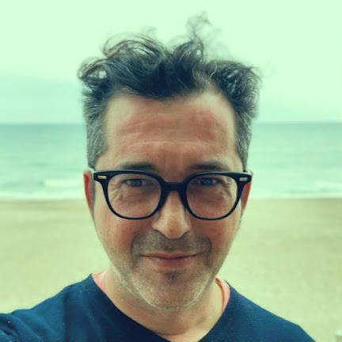

title: Internet Product Manager & Software Engineer
permalink: /
date: 2022-02-18 18:14:42
layout: page
description: Digital Product manager, Software engineer & Creative technologist born and raised in Barcelona.

---

    
    <h1>Daniel Canet</h1>
    <ul class="social" role="list">
        <li>
            <a href="https://github.com/dcanet-at-wiris" title="Visit Daniel Canet's GitHub profile from Wiris">
                GitHub Pro
            </a>
        </li>
        <li>
            <a href="https://github.com/dcanetma" title="Visit Daniel Canet's GitHub profile">
                GitHub Fun
            </a>
        </li>
         <li>
            <a href="www.linkedin.com/in/dcanetma" title="Visit Daniel Canet's LinkedIn profile">
                LinkedIn
            </a>
        </li>
        <li>
            <a href="https://twitter.com/dcanetma" title="Visit Daniel Canet's Twitter profile">
                Twitter
            </a>
        </li>
    </ul>
    

        <a href="mailto:hello@danielca.net" title="Contact by e-mail" class="btn">hello@danielca.net</a>
    

    

    <small><b>Full Stack Engineer</b>: Javascript, Node, Angular, React, VueJs, Google Workspace Apps, PHP, Drupal Architect, Moodle developer, Ruby on Rails, HTML, CSS, Relational DBs, GraphQL, Jenkins, TravisCI, GH Actions.</small>   
    

    <h2>
        Product Manager & Web developer.
    </h2>
    
<b>Daniel Canet is a Software Engineer from Barcelona</b>. He is a graduate of
        the <a href="https://www.fib.upc.edu/en/fib">Facultat d'Informàtica de Barcelona (FIB)</a>, one
        of the Top 10 computer science schools in Europe. 
    

    
He currently works as <b>Integrations Product Manager</b> for <a href="https://www.wiris.com/"
            title="Current position">MathType at Wiris</a>, a math and science software company based in Barcelona, Spain. Previous projects include collaborations with companies like <b>CASIO</b>, <b>BMW</b>,
        <b>Carrefour</b>, <b>Lacoste</b>, <b>Hangar.org</b>, <b>Volkswagen</b>, <b>Amnesty International</b>, <b>Bodegas Martín
        Códax</b>, <b>CREAF</b> and more. 

    
Daniel has been working as <b>Product & Engineering manager for internet products and companies</b> for almost two decades. He also <b>founded a succesful web development studio and a marketing & communication agency</b>. Passionate about product development, web programming, the open-source
        movement, <b>best practices, API-first and API governance</b>, agile methodologies, science and maths, design systems and the use of storytelling to build succesful software experiences.
        <b>Enthusiastic about projects that have a positive impact</b> on health, culture and local communities.
    

    
Spent his early professional years on a national company using proprietary technologies from <b>IBM</b>
        and <b>Microsoft</b>. After which he founded his first web development shop, <b>Strabinarius</b>, where he started
        to create experiences on the internet for remarkable brands. He then went on to work as an independent
        <b>creative technologist</b> and joined <a href="https://ouyeahstudio.com/" title="OuYeahStudio!">OuYeahStudio!</a>, a multidisciplinary design team from Barcelona. After that,
        he joined <a href="https://season.es/" title="Season">Season</a>, where he directed a bunch of designers, coders and marketers, while being a senior contributor for back-end, front-end code and deploy automation. More recently he
        founded <b>facts&fictions</b>, a creative studio to improve tools and methodologies while focusing on
        more local, personal and art based projects. 
    

    

        He also dedicates his spare time on <a href="https://www.google.com/search?safe=off&q=spaingovedits">experimental projects like Twitter bots</a> and enjoys collaborating with artists and creative studios like <a href="http://hodoandmarie.com/" title="Hodo & Marie website">Hodo & Marie for whom he designed and built their website for</a>, to explore Intrinsic web design techniques on a real world project.         
        <!-- Like the <a href="https://www.guiri.club/" title="We Are Not Artists">Guiri Institute</a>, a research group on design, technology and motion-graphics. -->
    

